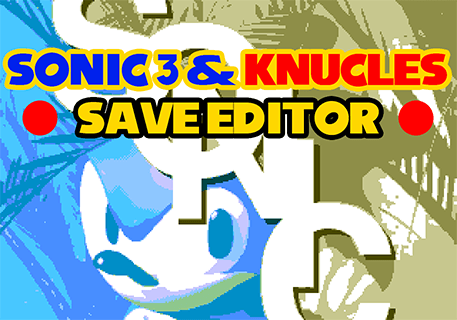

# Sonic 3 & Knuckles Save Editor

This is a project I decided to not longer maintain the 25 September of 2010.

Since a fan asked for a re-upload of this as my old website went down, I decided not only to re-upload it, but to make it open source and fix some annoying stuff that affected the 9 years old release!

The quality of the code is terrible (I was a teenager with few months of programming knowledge) and there are minor English grammar errors across comments or variable names.

## Features

* Modify the save from Sonic & Knuckles Collection (PC release)
* Sonic 3 & Knuckles save slots
* Sonic the Hedgehog 3 save slots
* Flying Battery Zone on Sonic the Hedgehog 3
* Blue Knuckles
* Tails in The Doomsday Zone
* Knuckles in Death Egg Zone and The Doomsday Zone
* Add V-Sync in windowed mode
* Enable frame counter
* Enable Debug mode
* Disable CD check

## Commands

* F1: Display the guide
* F4: Change the window size
* 1-8: Change slot
* PgUp/PgDown: Change editing mode
    * Sonic 3 & Knuckles
    * Sonic the Hedgehog 3
    * Time Attack
    * Settings
* Left/Right: Change value
* Up/Down: Select the value to change
* Space: Give or remove all the emeralds
* Shift: Enable the second batch of Special Stages
* Enter: Create a new file
* Escape: Leave the guide or exit from the editor
